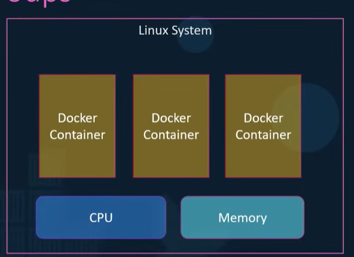

Commands

```bash
docker network create front-tier
docker network create back-tier

docker volume create db-date
```

```bash
docker run -e POSTGRES_USER="postgres" -e POSTGRES_PASSWORD="postgres" -v db-data:/var/lib/postgresql/data -v "$(pwd)/healthchecks:/healthchecks" --health-cmd="/healthchecks/postgres.sh" --health-interval=5s --network=back-tier --name=db postgres:15-alpine
```

```bash
docker run -d -v "$(pwd)/healthchecks:/healthchecks" --health-cmd="/healthchecks/redis.sh" --health-interval=5s --network=back-tier --name=redis redis:alpine
```

```bash
# build image
docker build -t worker ./worker

# Run contianer
docker run -d --network=back-tier --name=worker worker
```

```bash
# build result image
docker build -t result ./result

docker run -d -p 8081:80 -p 127.0.0.1:9229:9229 -v "$(pwd)/result:/usr/local/app" --network=front-tier --name=result --entrypoint="nodemon" --inspect=0.0.0.0 server.js result

# connecting to backend network
docker network connect back-tier result
```

```bash
# build the image
docker build --target=dev -t vote ./vote

docker run -d -p 8080:80 -v "$(pwd)/vote:/usr/local/app" --network=front-tier --health-cmd="curl -f http://localhost" --health-interval=15s --health-timeout=5s --health-retries=3 --health-start-period=10s --name=vote --cap-add=NET_BIND_SERVICE vote

# connect to the backend network
docker network connect back-tier vote
```

```bash
docker build -t seed ./seed-data

docker run -d --network=front-tier --restart-no --name=seed seed
```

Specify custom hosts
-H=IPAddr:2375

Docker uses namespaces to isolate the processes

Using the PID namespace, the process ID's can be reused inside the conatiner only, so the container has it's root process tree and the host is a seprate while being mapped to the PID's of the host

The container's inside the services PID are different than the hosts

Using cgroups, the resources are shared between the containers



limiting CPU and memery

```bash
docker run --cpu=0.5 <image>
docker run --memory=512m <image>
```

The hyper-v give each of the container it's own kernel
The window container use the hyper-v based isolation of resources

Why orchestrate ?
To run containers at scale by deploying them using scale sets, docker swarm or kubernetes.

Solution consisting the solutions to run multiple containers to run at scale of production level. Allows to deploy 100 or 1000 of the conatiner

One host as the swarm manager and the others are the slave, so docker swarm uses the master slave architecture

# Docker Swarm

```bash
# init the swarm on the manager
docker swarm init --advertise-addr 192.168.1.12
```

```bash
# on workers, we join them to the swarm manager
docker swarm join --token <token-from-swarm-manager>
```

```bash
# creating the service
docker service create --replicas=3 <application>
```

```bash
# running a stack of docker compose on swarm
docker stack deploy -c docker-compose.yml myapp
```

```bash
# creating rolling updated
docker docker service update --image vote:v2 myapp_vote
```

Kubernetes Components

- Api Server: API server to which outside traffic operates with
- etcd: key value store
- Scheduler: Schedules the pods on the container
- Controller: Makes decisions based on the situation
- Kubelet: Utility ensures that the container are running
- Container Runtime: Container runtime used to run containers e.g. docker

```bash
kubectl run hello-minikube
kubectl cluster-info
kubectl get nodes
```
